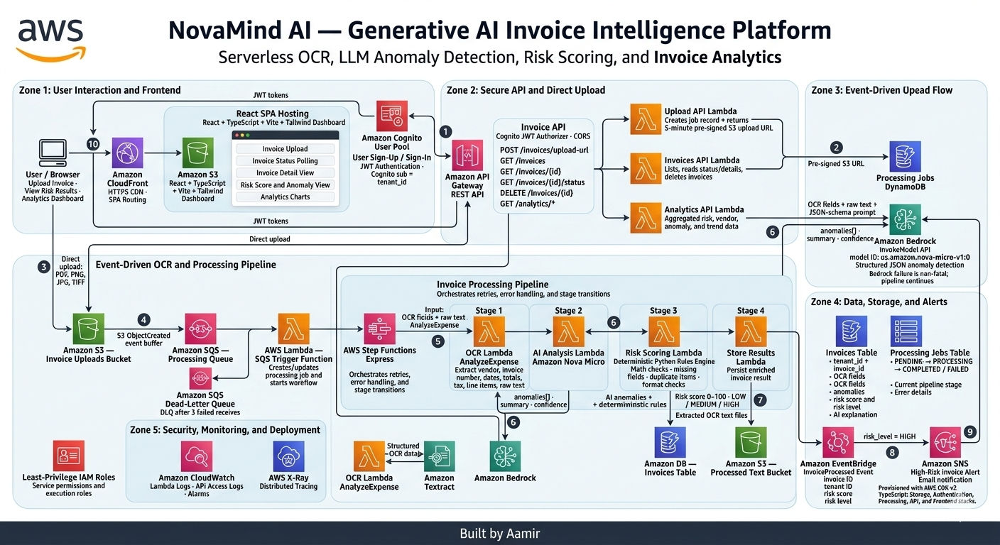

# NovaMind Ai Invoice Intelligence Platform

> AI-powered serverless invoice processing with anomaly detection, risk scoring, and a full React dashboard — built on AWS.

**Created by [Aamir](https://github.com/aamir490)** · [LinkedIn](https://www.linkedin.com/in/aamir-imran)


---
# Architecute of the project :- 


## Screenshots

### Dashboard


### Dashboard


### Uploaded Invoice — Processed with AI Risk Score


### Analytics


---

## For Deployment use - 
- **deploy_project_via_clone.md**

## What This Does

Upload an invoice image → Amazon Textract extracts every field → Amazon Bedrock AI detects anomalies → a rules engine scores the risk 0–100 → results are stored in DynamoDB → everything is displayed in a React dashboard with charts, filters, and per-invoice detail views.

**No servers. No manual steps. Fully automated end to end.**

---

## How It Works — Complete Data Flow

```
Step 1 — User uploads invoice
─────────────────────────────
Browser → POST /invoices/upload-url (with Cognito JWT)
       ← API returns a pre-signed S3 URL (5 min expiry)
Browser → PUT file directly to S3 (no API Gateway in the path)

Step 2 — S3 triggers the pipeline
──────────────────────────────────
S3 ObjectCreated event
  → SQS Queue (decouples upload from processing)
    → SQS Trigger Lambda
      → Step Functions Express starts with payload:
        { invoice_id, tenant_id, s3_key, job_id }

Step 3 — Step Functions pipeline (4 stages)
────────────────────────────────────────────
Stage 1: OCR Lambda
  - Calls Textract AnalyzeExpense
  - Extracts: vendor, dates, total, line items, subtotal, tax
  - Returns structured invoice_data + raw text_lines

Stage 2: AI Analysis Lambda
  - Builds a structured JSON-schema prompt
  - Calls Bedrock Nova Micro
  - Returns: anomalies[], summary, confidence score
  - Non-fatal: pipeline continues even if Bedrock is throttled

Stage 3: Risk Scoring Lambda
  - Deterministic rules: math error check, missing fields,
    duplicate line items, non-standard invoice number
  - Combines with AI anomalies
  - Produces: risk_score (0–100) + LOW / MEDIUM / HIGH

Stage 4: Store Results Lambda
  - Writes complete invoice record to DynamoDB
  - Saves extracted text to S3 (processed bucket)
  - Fires EventBridge InvoiceProcessed event
  - Updates job status to COMPLETED

Step 4 — Browser reads results
──────────────────────────────
Browser polls GET /invoices/{id}/status → COMPLETED
Browser loads GET /invoices/{id}        → full invoice detail

Step 5 — High-risk alert
─────────────────────────
EventBridge Rule (risk_level = HIGH)
  → SNS Topic → Email alert
```

---

## Architecture Diagram

```
┌─────────────────────────────────────────────────────┐
│                   Browser                           │
│              React SPA (Vite + Tailwind)            │
└──────────────┬──────────────────────────────────────┘
               │ HTTPS
┌──────────────▼──────────────────────────────────────┐
│              CloudFront (CDN + HTTPS)                │
└──────────────┬──────────────────────────────────────┘
               │
       ┌───────┴────────┐
       │                │
┌──────▼──────┐  ┌──────▼───────────────────────────┐
│   Cognito   │  │         API Gateway REST           │
│  User Pool  │  │  /invoices  /analytics  /upload   │
│  (JWT Auth) │  └──────┬───────────────────────────┘
└─────────────┘         │
                ┌───────┼──────────┐
                │       │          │
          ┌─────▼──┐ ┌──▼───┐ ┌───▼──────┐
          │ upload │ │ invs │ │analytics │  ← Lambda functions
          └─────┬──┘ └──┬───┘ └───┬──────┘
                │       │         │
                └───────┴─────────┘
                            │
                       ┌────▼────┐
                       │DynamoDB │
                       │invoices │
                       │  jobs   │
                       └─────────┘
                            ▲
S3 Upload                   │
    │                       │
    ▼                       │
  SQS ──► Lambda ──► Step Functions Express
                         │
              ┌──────────┼──────────┬──────────┐
              │          │          │          │
          ┌───▼───┐ ┌────▼──┐ ┌────▼───┐ ┌───▼─────┐
          │  OCR  │ │  AI   │ │  Risk  │ │  Store  │
          │Textract│ │Bedrock│ │ Rules  │ │DynamoDB │
          └───────┘ └───────┘ └────────┘ └─────────┘
                                              │
                                    EventBridge ──► SNS
                                    CloudWatch + X-Ray
```

---

## Tech Stack

| Layer | Technology |
|-------|-----------|
| Frontend | React 18, TypeScript, Vite, Tailwind CSS, Recharts |
| State management | Zustand + React Query |
| Auth | Amazon Cognito (SRP flow, JWT tokens) |
| API | Amazon API Gateway REST + Lambda (Python 3.12, ARM64) |
| Processing pipeline | AWS Step Functions Express |
| OCR | Amazon Textract `AnalyzeExpense` |
| AI / LLM | Amazon Bedrock — Nova Micro (structured JSON output) |
| Risk scoring | Custom rules engine (Python) |
| Database | Amazon DynamoDB (on-demand, multi-tenant) |
| Storage | Amazon S3 (uploads + processed text + frontend) |
| CDN | Amazon CloudFront |
| Alerting | Amazon EventBridge + SNS |
| Tracing | AWS X-Ray |
| Infrastructure | AWS CDK v2 (TypeScript) — 5 stacks |
| CI/CD | GitHub Actions with OIDC (no stored AWS keys) |

---

## Project Structure

```
NovaMind-Ai-Invoice-Intelligence/
│
├── backend/
│   ├── lambdas/
│   │   ├── ocr/                # Stage 1: Textract AnalyzeExpense
│   │   │   ├── handler.py
│   │   │   └── parser.py
│   │   ├── ai_analysis/        # Stage 2: Bedrock anomaly detection
│   │   │   ├── handler.py
│   │   │   └── prompt_builder.py
│   │   ├── risk_scoring/       # Stage 3: Rules engine (score 0–100)
│   │   │   ├── handler.py
│   │   │   └── rules.py
│   │   ├── store_results/      # Stage 4: DynamoDB + EventBridge
│   │   │   └── handler.py
│   │   ├── sqs_trigger/        # SQS → Step Functions bridge
│   │   │   └── handler.py
│   │   ├── api/                # REST API handlers
│   │   │   ├── upload.py       # POST /invoices/upload-url
│   │   │   ├── invoices.py     # GET/DELETE /invoices
│   │   │   └── analytics.py    # GET /analytics/*
│   │   └── shared/             # Shared across all Lambdas
│   │       ├── db.py           # DynamoDB helpers
│   │       ├── models.py       # Pydantic data models
│   │       ├── exceptions.py   # Custom exceptions
│   │       └── response.py     # API response helpers + CORS
│   ├── step-functions/
│   │   └── processing-pipeline.json
│   └── tests/
│       └── unit/               # pytest unit tests (no AWS needed)
│
├── frontend/
│   └── src/
│       ├── pages/
│       │   ├── LoginPage.tsx
│       │   ├── DashboardPage.tsx
│       │   ├── InvoicesPage.tsx
│       │   ├── InvoiceDetailPage.tsx
│       │   └── AnalyticsPage.tsx
│       ├── components/
│       │   ├── layout/         # Sidebar, Header, Layout
│       │   ├── invoices/       # InvoiceList, InvoiceUpload, InvoiceCard
│       │   └── analytics/      # Charts, KPI cards
│       ├── services/
│       │   ├── api.ts          # Axios client + interceptors
│       │   ├── auth.ts         # AWS Amplify auth
│       │   └── upload.ts       # S3 presigned upload
│       ├── store/              # Zustand: auth, filters, upload state
│       └── types/              # TypeScript interfaces
│
├── infrastructure/             # AWS CDK v2 — 5 stacks
│   └── lib/
│       ├── storage-stack.ts    # S3 (3 buckets) + DynamoDB (2 tables) + SQS
│       ├── auth-stack.ts       # Cognito User Pool + Web Client
│       ├── processing-stack.ts # Step Functions + 5 Lambdas + EventBridge + SNS
│       ├── api-stack.ts        # API Gateway + 3 API Lambdas + Cognito auth
│       └── frontend-stack.ts   # CloudFront + S3 static hosting
│
├── .github/workflows/
│   ├── backend.yml             # pytest + CDK deploy on push to main
│   ├── frontend.yml            # build + S3 deploy + CloudFront invalidation
│   └── pr-checks.yml          # tests + cdk synth on every PR
│
├── invoices/                   # Sample invoice images for testing
├── project_pic/                # Screenshots
├── deploy_project_via_clone.md # Step-by-step deploy guide for new users
└── .env.example                # Environment variable reference
```

---

## AWS Services Used

| Service | Purpose |
|---------|---------|
| **S3** | Invoice file uploads, extracted text storage, frontend static hosting |
| **DynamoDB** | Invoice records and processing job status (multi-tenant, PAY_PER_REQUEST) |
| **SQS + DLQ** | Decouples S3 upload events from processing pipeline |
| **AWS Lambda** | 8 functions — 5 pipeline + 3 API (ARM64, Python 3.12) |
| **Step Functions Express** | Orchestrates 4-stage pipeline with retry and error handling |
| **Amazon Textract** | `AnalyzeExpense` — extracts structured fields from invoice images |
| **Amazon Bedrock** | Nova Micro LLM for AI anomaly detection (structured JSON output) |
| **API Gateway REST** | REST API with Cognito JWT authorization and CORS |
| **Amazon Cognito** | User authentication — SRP flow, JWT tokens as tenant IDs |
| **CloudFront** | HTTPS CDN for React SPA with SPA routing fallback |
| **EventBridge + SNS** | HIGH risk invoice alerts |
| **CloudWatch + X-Ray** | Logs, alarms, and distributed tracing |
| **AWS CDK v2** | Infrastructure as Code — 5 separate stacks |

---

## Key Design Decisions

**Why Step Functions instead of one big Lambda?**
Per-stage retry without re-running expensive Textract calls. Visual execution graph for debugging. Failure isolation — one stage failing doesn't corrupt the others.

**Why SQS between S3 and Step Functions?**
S3 can't invoke Step Functions directly. SQS buffers burst uploads, handles retries via visibility timeout, and sends poison-pill messages to a DLQ after 3 failed attempts.

**Why pre-signed S3 URLs for file upload?**
The file goes directly from the browser to S3 — bypasses API Gateway's 10MB payload limit and saves Lambda bandwidth costs entirely.

**Why structured JSON output from Bedrock?**
Free-text AI output can't be filtered, sorted, or charted. A JSON schema prompt forces the model to return typed anomaly objects that power every dashboard feature.

**Why both AI and a rules engine for risk scoring?**
AI catches nuanced issues (unusual prices, date inconsistencies). The rules engine catches math errors and missing fields with 100% reliability. The combined score is more robust than either alone.

**Why multi-tenant isolation via Cognito `sub`?**
The Cognito `sub` (UUID) from the JWT becomes the DynamoDB partition key. Every query includes `KeyConditionExpression: tenant_id = :sub` — one tenant can never see another's data without changing a single line of application logic.

---

## Cost Estimate (1,000 invoices/month)

| Service | Estimated Cost |
|---------|---------------|
| Amazon Textract | ~$15 |
| Amazon Bedrock (Nova Micro) | ~$2 |
| Lambda (all 8 functions) | ~$0 (free tier) |
| DynamoDB | ~$0 (free tier) |
| S3 | ~$0.10 |
| SQS | ~$0 (free tier) |
| CloudFront | ~$0.10 |
| **Total** | **~$17–20 / month** |

---

## Deploy This Project

See **[deploy_project_via_clone.md](deploy_project_via_clone.md)** for the complete step-by-step deployment guide.

Quick overview:
1. `aws configure` — set up your AWS credentials
2. Enable Bedrock Nova Micro model access in AWS Console
3. `cd infrastructure && npm ci && npx cdk bootstrap`
4. Build the Lambda layer (shared Python code)
5. `npx cdk deploy --all --context env=dev`
6. Run `fix-layer.ps1` to attach the layer to all functions
7. Create `frontend/.env.local` with CDK output values
8. `cd frontend && npm run dev` → open http://localhost:5173

---

## Run Unit Tests

```bash
pip install -r backend/tests/requirements-test.txt
cd backend
pytest tests/unit/ -v
```

All tests run without AWS credentials using pure Python logic.

---

## CI/CD (GitHub Actions)

Every push to `main` automatically:
1. Runs Python unit tests with coverage
2. Deploys infrastructure changes via CDK (OIDC — no stored AWS keys)
3. Builds the React app
4. Syncs to S3 and invalidates CloudFront cache

Add these secrets in GitHub → Settings → Secrets → Actions:

| Secret | Source |
|--------|--------|
| `AWS_DEPLOY_ROLE_ARN` | IAM role with OIDC trust for GitHub Actions |
| `VITE_API_URL` | CDK output: `ApiUrl` |
| `VITE_COGNITO_USER_POOL_ID` | CDK output: `UserPoolId` |
| `VITE_COGNITO_USER_POOL_CLIENT_ID` | CDK output: `UserPoolClientId` |
| `FRONTEND_BUCKET` | CDK output: `FrontendBucketName` |
| `CF_DISTRIBUTION_ID` | CDK output: `DistributionId` |

---

## Author

**Aamir**
- GitHub: [github.com/aamir490](https://github.com/aamir490)
- LinkedIn: [linkedin.com/in/aamir-imran](https://www.linkedin.com/in/aamir-imran)

---

# Architecture of the Project


---

## ⏱️ 30-Second Elevator Pitch

"NovaMind AI is a secure, multi-tenant, completely serverless event-driven platform designed to automate invoice ingestion, document processing, and risk intelligence at scale. By leveraging an asynchronous orchestration pipeline, the system extracts text via Amazon Textract, injects generative AI anomaly detection using Amazon Bedrock Nova Micro, and overlays deterministic scoring rules. It handles unpredictable traffic surges natively, isolates customer data cleanly at the authentication tier, and operates entirely on a pay-per-use cost model with zero infrastructure to manage."

---

## 🔄 Detailed End-to-End Technical Flow

```
[User Browser] ──(1) Get SPA──> [CloudFront] ──(1) Fetch Source──> [S3 React SPA]
      │
     (2) Auth Credentials ──> [Cognito User Pool] ──(2) Return JWT Token
      │
     (3) POST /invoices/upload-url (With JWT Header) ──> [API Gateway] ──> [Upload Lambda]
      │                                                                           │
     (3) Pre-signed Upload URL <──────────────────────────────────────────────────┘
      │
     (4) PUT /invoice.pdf (Direct Upload) ──> [S3 Uploads Bucket]
```

### 1. User Login and React Frontend Delivery

- **Why:** CloudFront acts as a global CDN to cache and serve static assets at low latency. S3 provides durable, cost-effective static website hosting for the React SPA.
- **What moves:** Browser requests the app; CloudFront delivers the compiled React + TypeScript + Vite + Tailwind bundle.
- **Process:** Synchronous.

### 2. Cognito Authentication and JWT-Based Tenant Isolation

- **Why:** Cognito offloads identity management, sign-up, and sign-in securely without custom backend auth code.
- **Tenant isolation:** When a user authenticates, Cognito issues a JWT containing a `sub` claim unique to that user, which maps directly to `tenant_id` in DynamoDB. Every Lambda extracts this from the decoded token context — a tenant can never read, modify, or delete another tenant's data.
- **What moves:** Credentials go to Cognito; JWT tokens return to the React SPA.
- **Process:** Synchronous.

### 3. API Gateway and Pre-signed S3 Upload URL

- **Why:** API Gateway manages routing, CORS, and verifies JWT tokens natively via a Cognito JWT Authorizer. Upload Lambda reserves database state and generates secure upload parameters.
- **What moves:** Browser sends `POST /invoices/upload-url` with JWT. Upload Lambda creates a PENDING job in DynamoDB and returns a 5-minute pre-signed S3 URL.
- **Process:** Synchronous.

### 4. Direct Invoice Upload from Browser to S3

- **Why:** Pushing files directly to S3 protects API layers from payload constraints (API Gateway has a strict 10MB limit) and saves Lambda execution time.
- **What moves:** Browser PUTs the raw invoice file (PDF, PNG, JPG, or TIFF) directly to S3 using the pre-signed URL.
- **Process:** Synchronous from browser — marks the boundary where architecture shifts to async.

```
[S3 Uploads Bucket] ──(5) ObjectCreated──> [SQS Queue] ──(5) Poll──> [SQS Trigger Lambda]
                                               │                              │
                                      (Failed 3x) ──> [SQS DLQ]              ▼
                                                                 [Step Functions Express]
```

### 5. S3 Event → SQS → SQS Trigger Lambda

- **Why:** SQS acts as a durable buffer to smooth burst uploads. If 10,000 invoices are uploaded at once, SQS holds them safely without overwhelming downstream components. Failed messages go to DLQ after 3 attempts.
- **What moves:** S3 sends ObjectCreated to SQS. SQS Trigger Lambda consumes the bucket name and file key.
- **Process:** Asynchronous.

### 6. Step Functions Express Orchestration

```
AWS Step Functions Express
 ├── Stage 1: [OCR Lambda]   ───> [Amazon Textract AnalyzeExpense]
 ├── Stage 2: [AI Lambda]    ───> [Amazon Bedrock Nova Micro]
 ├── Stage 3: [Risk Lambda]  ───> Python Rules Engine (Math/Logic)
 └── Stage 4: [Store Lambda] ───> [DynamoDB] + [S3 Text] + [EventBridge]
```

- **Why Express over Standard:** Optimized for high-volume, short-duration workflows. Lower cost, higher throughput. My pipeline completes in under 5 minutes.
- **Why not one large Lambda:** Breaking into stages means each step has its own retry, isolated failure, and no idle CPU wait time.
- **Process:** Asynchronous.

### 7. OCR Lambda — Amazon Textract AnalyzeExpense

- **Why:** Textract AnalyzeExpense natively understands invoice geometry and automatically extracts tax fields, line items, totals, and vendor details without any training.
- **What moves:** Lambda tells Textract where the document is in S3. Textract returns structured OCR JSON.

### 8. AI Analysis Lambda — Amazon Bedrock Nova Micro

- **Why:** Bedrock provides managed access to foundation models via IAM — no API keys, data stays in AWS. Nova Micro is fast, cheap (~$2/month at 1,000 invoices), and follows structured JSON schema prompts reliably.
- **Failure handling:** If Bedrock is throttled or fails after 4 retries with exponential backoff, the failure is non-fatal. The anomaly array is set to empty and the pipeline continues.
- **What moves:** Lambda sends a prompt with OCR fields + raw text + strict JSON schema. Bedrock returns typed anomalies, summary, and confidence score.

### 9. Risk Scoring Lambda — Deterministic Rules Engine

- **Why AI + rules together:** LLMs excel at abstract pattern matching but struggle with exact math. The rules engine handles objective checks with 100% reliability. Combined score is more robust than either alone.
- **Scoring:** Math error (+40), missing fields (+8 each), duplicate items (+15), non-standard number (+10), AI HIGH (+15), MEDIUM (+7), LOW (+3). Capped at 100. Below 30 = LOW, 30–69 = MEDIUM, 70+ = HIGH.

### 10. Store Results Lambda

- **What it writes:** DynamoDB invoice record (COMPLETED), S3 processed text file, EventBridge `InvoiceProcessed` event, job status DONE.
- **Non-fatal:** EventBridge and S3 text save failures are logged but don't fail the pipeline.

### 11. EventBridge and SNS High-Risk Alerts

- **Why:** EventBridge filters `risk_level = HIGH` events and routes to SNS for email alerts. Decoupled — adding new targets (Slack, tickets) requires no Lambda code changes.

### 12. Frontend Polling

- Browser polls `GET /invoices/{id}/status` every 3 seconds. When COMPLETED, loads full detail with charts, anomaly list, risk gauge, and AI explanation.

---

## 🛡️ Security, Monitoring, and Deployment

- **IAM least privilege:** Every Lambda has its own execution role. Upload Lambda can only write to the upload bucket and jobs table.
- **Multi-tenant isolation:** DynamoDB partition key = Cognito `sub`. No query ever runs without tenant scope.
- **CloudWatch + X-Ray:** Distributed tracing across all services. DLQ alarm on any failed message.
- **CDK v2:** 5 stacks — Storage, Auth, Processing, API, Frontend — repeatable across environments.
- **GitHub Actions OIDC:** No long-lived AWS keys stored anywhere.

---

## 🎯 60-Second Polished Interview Closer

*"NovaMind AI is an intelligent invoice processing platform built entirely on a serverless, event-driven architecture. By utilizing a decoupled direct-upload model to Amazon S3 via pre-signed URLs, we avoid API Gateway payload limits. The intelligence core is orchestrated using AWS Step Functions Express, coordinating Textract for extraction, Bedrock Nova Micro for anomaly detection, and a Python rules engine for math compliance. Security is locked down via Cognito JWT tenant isolation and least-privilege IAM. Monitoring via CloudWatch and X-Ray. Deployed deterministically via CDK v2. The result is a system that scales from zero to tens of thousands of invoices, paying only for the exact seconds of compute consumed."*

---

## ❓ 5 Likely Interview Questions and Strong Answers

**1. Why Step Functions Express instead of Standard?**
Express is for high-volume, short-duration workflows under 5 minutes. Higher throughput, lower cost than Standard. Since invoice processing completes in seconds, Express is the right choice.

**2. Why polling instead of WebSockets?**
WebSockets require stateful connections, adding architectural complexity. Since analysis completes in seconds, optimized polling provides the same experience with simpler, stateless infrastructure.

**3. If the Invoices Table scales to millions of rows, how do you prevent performance degradation?**
The table uses `tenant_id` as partition key and `invoice_id` as sort key. All queries are targeted — never a full table scan. Single-digit millisecond latency regardless of table size.

**4. Why Nova Micro over a larger model?**
Invoice anomaly detection needs precise structured output, not deep reasoning. Nova Micro handles structured JSON schema prompts accurately at ultra-low cost. Mathematical checks are offloaded to the deterministic rules engine entirely.

**5. How does the architecture handle Bedrock throttling?**
Two layers: Step Functions retries with exponential backoff on throttling errors, and the AI Lambda internally catches all Bedrock failures after 4 attempts and returns empty anomalies — the pipeline always completes.

---

## 👪 Simple Explanation for a Non-Technical Audience

"Imagine NovaMind AI as a digital accountant that never sleeps. When a company uploads an invoice, the system places it into a secure digital drop-box. An automated process reads all the text, prices, and dates. An AI assistant reviews it for anything unusual or suspicious. A calculator checks all the math. If everything looks fine, it saves the results to the dashboard. If something looks highly suspicious, it fires an urgent email alert to the manager. The system only turns on during the exact seconds it processes a document — then turns itself off — so the company only pays for what it uses."
