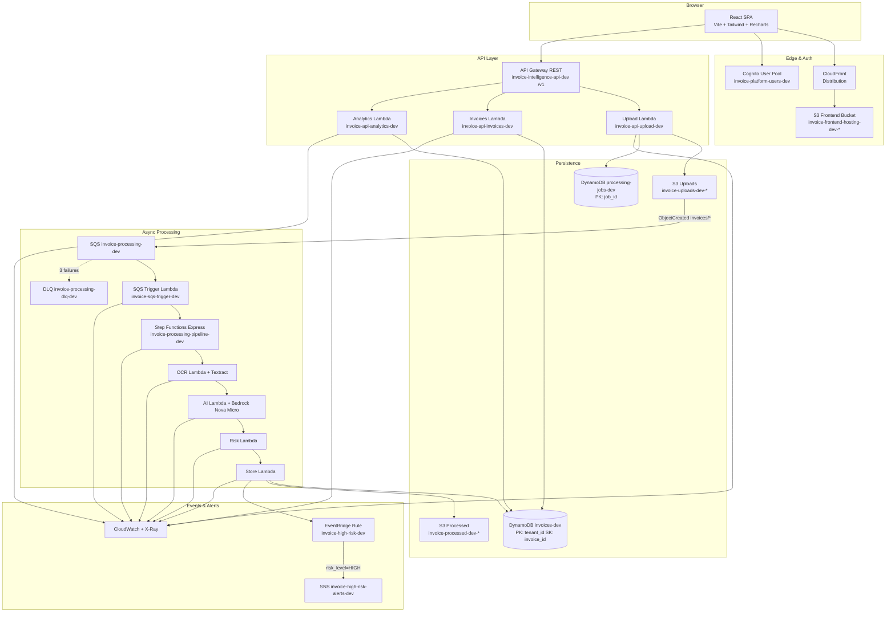
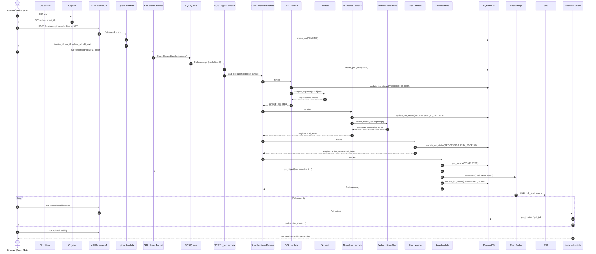

# NovaMind AI Invoice Intelligence Platform — Interview Preparation Guide

> **Principal Engineer documentation** for senior AWS / cloud architecture interviews.  
> All resource names, routes, and behaviors are extracted from this repository's actual code.

**Author:** Aamir · [GitHub](https://github.com/aamir490) · [LinkedIn](https://www.linkedin.com/in/aamir-imran)

---

## Table of Contents

1. [⏱️ The 5-Minute Elevator Pitch](#️-the-5-minute-elevator-pitch)
2. [🏗️ Complete System Architecture Walkthrough](#️-complete-system-architecture-walkthrough)
3. [⚖️ Why Each AWS Service Was Chosen](#️-why-each-aws-service-was-chosen)
4. [🔄 Request Lifecycle (Deep Dive)](#-request-lifecycle-deep-dive)
5. [⚡ Lambda Deep Dive](#-lambda-deep-dive)
6. [🔀 Step Functions Deep Dive](#-step-functions-deep-dive)
7. [🗄️ DynamoDB Data Model](#️-dynamodb-data-model)
8. [🤖 Amazon Bedrock & Textract Flow](#-amazon-bedrock--textract-flow)
9. [🔒 Security Architecture](#-security-architecture)
10. [⚠️ Edge Cases & Failure Scenarios](#️-edge-cases--failure-scenarios)
11. [📊 Observability](#-observability)
12. [💰 Cost Optimization](#-cost-optimization)
13. [📈 Scalability Analysis](#-scalability-analysis)
14. [🚀 CI/CD & Deployment Pipeline](#-cicd--deployment-pipeline)
15. [📁 Complete Project Folder Walkthrough](#-complete-project-folder-walkthrough)
16. [🔗 Code Flow Summary](#-code-flow-summary)
17. [❓ Interviewer Question Bank (20 Questions)](#-interviewer-question-bank-20-questions)
18. [⚡ Trade-Offs & Design Decisions](#-trade-offs--design-decisions)
19. [📝 Resume & Portfolio Talking Points](#-resume--portfolio-talking-points)
20. [📋 Final Interview Cheat Sheet](#-final-interview-cheat-sheet)

---

# ⏱️ The 5-Minute Elevator Pitch

> **Word-for-word spoken script — ~4–5 minutes at conversational pace.**

---

**Situation**

"At my organization, finance teams were drowning in manual invoice review. Vendors submit PDFs and scanned images with inconsistent formats, math errors slip through, and fraud patterns are hard to spot at scale. We needed an automated, multi-tenant platform that could ingest invoices, extract structured data, score risk, and surface results in a dashboard — without standing up servers."

**Task**

"I designed and built **NovaMind AI Invoice Intelligence Platform** — a production-style, fully serverless AWS application. The goal was end-to-end automation: upload an invoice image, run OCR and AI analysis, compute a deterministic risk score, persist results, alert on high-risk cases, and display everything in a React dashboard behind Cognito authentication."

**Action**

"Here's how it works. A user logs in through **Amazon Cognito** using SRP — no passwords sent in the clear — and gets a JWT. The **React SPA** is served over **HTTPS via CloudFront** from a private S3 bucket with Origin Access Control, so the bucket is never public.

When they upload an invoice, the browser calls **API Gateway** — `POST /invoices/upload-url` — with the Cognito JWT. The **Upload Lambda** generates a pre-signed S3 URL and creates a job record in DynamoDB. The file goes **directly from browser to S3** — bypassing API Gateway's payload limit entirely.

That S3 `ObjectCreated` event lands on an **SQS queue** — not straight into Lambda — which gives us buffering, back-pressure, and a **DLQ after three failed attempts**. The **SQS Trigger Lambda** starts a **Step Functions Express** state machine named `invoice-processing-pipeline-dev`.

The pipeline has four stages. Stage one: **OCR Lambda** calls **Textract AnalyzeExpense** and extracts vendor, dates, totals, and line items. Stage two: **AI Analysis Lambda** sends a structured JSON-schema prompt to **Amazon Bedrock Nova Micro** (`us.amazon.nova-micro-v1:0`) for anomaly detection — and importantly, Bedrock failures are **non-fatal**; the pipeline continues. Stage three: **Risk Scoring Lambda** runs deterministic rules — math checks, missing fields, duplicate line items — and combines them with AI findings into a score from 0 to 100. Stage four: **Store Results Lambda** writes the complete record to the **`invoices-dev` DynamoDB table**, saves extracted text to the processed S3 bucket, and fires an **`InvoiceProcessed` EventBridge event**.

For high-risk invoices — risk level **HIGH** — an **EventBridge rule** routes to an **SNS topic** for email alerts. The frontend polls `GET /invoices/{id}/status` every three seconds until status is **COMPLETED**, then loads the full detail view and analytics charts.

Everything is instrumented with **CloudWatch Logs**, **X-Ray tracing** on all Lambdas and Step Functions, and a **DLQ CloudWatch alarm** wired to the same SNS topic."

**Result**

"The platform processes a typical invoice in **15–30 seconds** end to end. At roughly **1,000 invoices per month**, total AWS cost is about **$17–20** — mostly Textract and Bedrock. Multi-tenant isolation is enforced at the data layer: every DynamoDB query scopes to the Cognito `sub` as `tenant_id`. Infrastructure is five **CDK v2 stacks** deployed via **GitHub Actions with OIDC** — no long-lived AWS keys in CI.

This isn't a demo script — it's a decoupled, retry-aware, observable serverless architecture you'd actually operate in production."

**Closing**

"If you remember one thing: NovaMind turns a raw invoice upload into an auditable, scored, tenant-isolated intelligence record — entirely on AWS serverless, with AI and rules working together, not either-or."

---

# 🏗️ Complete System Architecture Walkthrough

## High-Level Architecture



## Numbered Architecture Walkthrough (1–22)

| # | Component | Purpose | Input | Output | Why Used |
|---|-----------|---------|-------|--------|----------|
| 1 | **Browser** | React SPA for upload, invoice list, detail, analytics | User interactions, Cognito JWT | HTTPS requests to CloudFront + API Gateway | Rich UX with charts, drag-and-drop upload, real-time status polling |
| 2 | **CloudFront** | CDN + HTTPS termination for SPA | GET/HEAD/OPTIONS from browser | Cached static assets from S3 | Global edge delivery, TLS, SPA routing fallback (404→index.html), OAC to private S3 |
| 3 | **S3 Frontend Bucket** | Static hosting for built React app | `frontend/dist` via CDK BucketDeployment or CI sync | HTML/JS/CSS to CloudFront | Cheap, durable static hosting; bucket blocked from public access |
| 4 | **Cognito** | User authentication & tenant identity | Email + password (SRP flow) | JWT ID token (`sub` = tenant_id) | Managed auth, no custom JWT infrastructure, MFA-ready, SRP-only client |
| 5 | **API Gateway REST** | REST API with Cognito authorizer | JWT-authenticated HTTP requests | Lambda proxy responses with CORS | Native Cognito integration, stage-level logging, 29s Lambda timeout alignment |
| 6 | **Upload Lambda** (`invoice-api-upload-dev`) | Generate pre-signed S3 URL + create job | `POST /invoices/upload-url` body: `{filename, content_type}` | `{invoice_id, job_id, upload_url, s3_key, expires_in}` | Keeps large files off API Gateway; 5-min presigned URL expiry |
| 7 | **Invoice Lambda** (`invoice-api-invoices-dev`) | CRUD + status for invoices | GET/DELETE on `/invoices`, `/invoices/{id}`, `/invoices/{id}/status` | Invoice records, paginated lists, job status | Single handler, route-based dispatch, tenant-scoped queries |
| 8 | **Analytics Lambda** (`invoice-api-analytics-dev`) | Dashboard KPIs and charts | GET `/analytics/summary`, `/risk-trend`, `/vendor-stats`, `/anomaly-types` | Aggregated metrics per tenant | Serverless analytics without a separate warehouse at current scale |
| 9 | **Invoice Upload Bucket** (`invoice-uploads-dev-{account}`) | Raw invoice file storage | Browser PUT via presigned URL | S3 ObjectCreated event → SQS | Versioned, encrypted, CORS-enabled, intelligent tiering after 30 days |
| 10 | **SQS** (`invoice-processing-dev`) | Decouple upload from processing | S3 event notification JSON | Message to SQS Trigger Lambda | Buffer bursts, 120s visibility timeout, DLQ after 3 receives |
| 11 | **Trigger Lambda** (`invoice-sqs-trigger-dev`) | Bridge SQS → Step Functions | SQS event with S3 notification body | Step Functions execution started | Parses `invoices/{tenant_id}/{invoice_id}.ext` key structure |
| 12 | **Step Functions** (`invoice-processing-pipeline-dev`) | Orchestrate 4-stage pipeline | PipelinePayload JSON | Final store result or FAILED job | Express workflow, per-stage retry/catch, visual execution history |
| 13 | **OCR Lambda** (`invoice-ocr-dev`) | Extract structured invoice fields | PipelinePayload | Payload + `ocr_data` | Textract AnalyzeExpense — purpose-built for invoices/receipts |
| 14 | **AI Analysis Lambda** (`invoice-ai-analysis-dev`) | LLM anomaly detection | Payload + `ocr_data` | Payload + `ai_result` | Bedrock Nova Micro with structured JSON prompt; non-fatal on failure |
| 15 | **Risk Lambda** (`invoice-risk-scoring-dev`) | Deterministic + AI-combined scoring | Payload + `ocr_data` + `ai_result` | Payload + `risk_score` + `risk_level` + `all_anomalies` | 100% reliable math/missing-field checks complement probabilistic AI |
| 16 | **Store Results Lambda** (`invoice-store-results-dev`) | Persist final record + notify | Complete pipeline payload | DynamoDB item + EventBridge event | Single write point; publishes `InvoiceProcessed` for alerting |
| 17 | **DynamoDB Invoice Table** (`invoices-dev`) | Multi-tenant invoice records | `put_item` from Store Lambda | Query results for API/analytics | On-demand billing, composite key, GSIs for status/risk queries |
| 18 | **DynamoDB Jobs Table** (`processing-jobs-dev`) | Processing job lifecycle | `create_job`, `update_job_status` | Status polling for frontend | Tracks stage (OCR, AI_ANALYSIS, etc.), TTL-enabled cleanup |
| 19 | **Processed Text Bucket** (`invoice-processed-dev-{account}`) | Extracted OCR text archive | Plain text from Store Lambda | `processed-text/{tenant_id}/{invoice_id}.txt` | Audit trail, future RAG/search without re-running Textract |
| 20 | **EventBridge** | Event routing for alerts | `InvoiceProcessed` events (source: `invoice-platform`) | Matched events → SNS | Decoupled alerting; extensible for future Lambda targets |
| 21 | **SNS** (`invoice-high-risk-alerts-dev`) | HIGH risk email notifications | EventBridge target + DLQ alarm action | Email to subscribed addresses | Simple ops alerting without building notification service |
| 22 | **CloudWatch + X-Ray** | Logs, metrics, traces, alarms | Lambda/SFN/API logs, X-Ray segments | Dashboards, alarms, trace maps | End-to-end debugging; DLQ alarm on `invoice-dlq-messages-dev` |

---

# ⚖️ Why Each AWS Service Was Chosen

| Chosen | Alternative | Why Chosen |
|--------|-------------|------------|
| **API Gateway + Lambda** | ECS / EKS | Zero idle cost, auto-scales to zero, 29s timeout fits API ops; no cluster management |
| **Lambda (ARM64, Python 3.12)** | EC2 | Pay-per-invocation, native Textract/Bedrock SDK, shared layer for code reuse |
| **Step Functions Express** | Lambda chaining / SQS fan-out | Built-in retry/catch per stage, execution history, failure isolation without re-running Textract |
| **SQS** | Direct S3 → Lambda trigger | Buffers burst uploads; S3 cannot invoke Step Functions directly; DLQ for poison pills |
| **DynamoDB (PAY_PER_REQUEST)** | RDS PostgreSQL | Serverless, single-digit ms latency, natural fit for tenant_id partition key pattern |
| **Bedrock (Nova Micro)** | OpenAI API | AWS-native IAM auth, no API key leakage, data stays in AWS, lower egress cost |
| **Textract AnalyzeExpense** | Tesseract self-hosted | Managed OCR tuned for invoices; no GPU infrastructure |
| **CloudFront + OAC** | Direct S3 website hosting | HTTPS, caching, SPA routing, private bucket (no public S3 website) |
| **Cognito** | Custom JWT Auth (Auth0/Lambda) | Fully managed user pools, native API Gateway authorizer, SRP flow |
| **EventBridge + SNS** | Direct SNS from Lambda | Decoupled event routing; filter on `risk_level=HIGH` without Lambda knowing subscribers |
| **Pre-signed S3 upload** | Multipart via API Gateway | Bypasses 10MB API Gateway limit; zero Lambda bandwidth for file bytes |
| **CDK v2 (TypeScript)** | Terraform / CloudFormation YAML | Type-safe constructs, L2 abstractions, multi-stack composition with dependencies |
| **GitHub Actions OIDC** | Long-lived IAM access keys | No secrets rotation burden; short-lived credentials per workflow run |

**Decision factors applied:** latency (Express SFN ~ sub-second orchestration overhead), cost (pay-per-use at low volume), scalability (SQS + Lambda concurrency), operational complexity (managed services), AWS-native integration (Cognito authorizer, X-Ray on Lambda).

---

# 🔄 Request Lifecycle (Deep Dive)

## Sequence Diagram



## Payload Transformations

### 1. Upload API Request/Response

**Request:** `POST /invoices/upload-url`
```json
{
  "filename": "invoice.png",
  "content_type": "image/png"
}
```

**Response (201):**
```json
{
  "invoice_id": "inv_20260826_a1b2c3d4",
  "job_id": "job_inv_20260826_a1b2c3d4",
  "upload_url": "https://invoice-uploads-dev-....s3.amazonaws.com/...",
  "s3_key": "invoices/{cognito_sub}/inv_20260826_a1b2c3d4.png",
  "expires_in": 300
}
```

### 2. S3 → SQS Event Body

Standard S3 `ObjectCreated` notification wrapped in SQS `Records[].body`.

### 3. Step Functions Initial Input (PipelinePayload)

```json
{
  "invoice_id": "inv_20260826_a1b2c3d4",
  "tenant_id": "cognito-sub-uuid",
  "s3_key": "invoices/{tenant_id}/{invoice_id}.png",
  "bucket": "invoice-uploads-dev-637423369471",
  "job_id": "job_inv_20260826_a1b2c3d4",
  "created_at": "2026-08-26T10:00:00.000Z"
}
```

Each Lambda **merges** its output into this payload (`ocr_data` → `ai_result` → `risk_score` → final store).

### 4. EventBridge Event Schema

```json
{
  "Source": "invoice-platform",
  "DetailType": "InvoiceProcessed",
  "Detail": {
    "invoice_id": "...",
    "tenant_id": "...",
    "risk_score": 75,
    "risk_level": "HIGH",
    "processed_at": "2026-08-26T10:00:25.000Z"
  }
}
```

**Note:** `store_results/handler.py` publishes to `EventBusName: invoice-platform`. The CDK `HighRiskRule` listens on the **default** event bus. For production, either create a custom bus in CDK or publish to the default bus — verify bus alignment during deployment.

## Retries & Failure Paths

| Stage | Retry | Catch | Failure Behavior |
|-------|-------|-------|------------------|
| OCR | 2× on `Lambda.ServiceException`, 2s backoff ×2 | → HandleFailure | Job status FAILED in DynamoDB |
| AI Analysis | 3× on service exceptions, 5s backoff | → HandleFailure | Lambda itself catches Bedrock errors → empty anomalies (non-fatal) |
| Risk Scoring | None at SFN level | → HandleFailure | Pure compute — rarely fails |
| Store Results | 3× on service exceptions | → HandleFailure | DynamoDB write failure triggers catch |
| SQS Trigger | SQS redelivery (visibility 120s) | After 3 receives → DLQ | CloudWatch alarm on DLQ ≥ 1 message |

**SQS Trigger:** `reportBatchItemFailures: true` — failed messages return to queue.

**Frontend polling:** `useInvoiceStatus` refetches every **3 seconds** while status is `PENDING` or `PROCESSING`.

---

# ⚡ Lambda Deep Dive

## Summary Table

| Lambda | Folder | Trigger | Timeout | Memory | Key IAM |
|--------|--------|---------|---------|--------|---------|
| `invoice-api-upload-{env}` | `backend/lambdas/api/upload.py` | API GW POST | 29s | 256MB | S3 Put, Jobs RW |
| `invoice-api-invoices-{env}` | `backend/lambdas/api/invoices.py` | API GW GET/DELETE | 29s | 256MB | Invoices RW, Jobs R, S3 Delete |
| `invoice-api-analytics-{env}` | `backend/lambdas/api/analytics.py` | API GW GET | 29s | 256MB | Invoices Read |
| `invoice-sqs-trigger-{env}` | `backend/lambdas/sqs_trigger/` | SQS (batch=1) | 30s | 256MB | SFN StartExecution, Jobs RW |
| `invoice-ocr-{env}` | `backend/lambdas/ocr/` | Step Functions | 60s | 256MB | S3 Read, Textract, Jobs RW |
| `invoice-ai-analysis-{env}` | `backend/lambdas/ai_analysis/` | Step Functions | 60s | 512MB | Bedrock InvokeModel, Jobs RW |
| `invoice-risk-scoring-{env}` | `backend/lambdas/risk_scoring/` | Step Functions | 30s | 256MB | Jobs RW only |
| `invoice-store-results-{env}` | `backend/lambdas/store_results/` | Step Functions | 30s | 256MB | Invoices Write, Jobs RW, S3 Write, events:PutEvents |

**Shared layer:** `shared-layer-v2` (pydantic, boto3, `shared.db`, `shared.models`, `shared.response`, `shared.exceptions`)

**Tracing:** All Lambdas have `Tracing.ACTIVE` (X-Ray).

---

### Upload Lambda — `invoice-api-upload-dev`

| Attribute | Detail |
|-----------|--------|
| **Purpose** | Issue pre-signed S3 PUT URL; create PENDING job |
| **Trigger** | `POST /invoices/upload-url` |
| **Input** | API Gateway proxy event with Cognito claims |
| **Output** | 201 JSON with upload URL and IDs |
| **Env vars** | `UPLOADS_BUCKET`, `JOBS_TABLE`, `ALLOWED_ORIGINS` |
| **Error handling** | 400 for bad content type; 500 for S3 errors |
| **Idempotency** | New `invoice_id` per request (UUID suffix) |

---

### Invoices Lambda — `invoice-api-invoices-dev`

| Attribute | Detail |
|-----------|--------|
| **Purpose** | List, get, status, delete invoices (tenant-scoped) |
| **Routes** | `GET /invoices`, `GET /invoices/{id}`, `GET /invoices/{id}/status`, `DELETE /invoices/{id}` |
| **Input** | Query params: `status`, `risk_level`, `page_size`, `cursor` |
| **Output** | Invoice JSON or paginated list with base64 cursor |
| **Idempotency** | DELETE is idempotent (404 if not found) |

---

### Analytics Lambda — `invoice-api-analytics-dev`

| Attribute | Detail |
|-----------|--------|
| **Purpose** | Compute dashboard KPIs by scanning tenant invoices |
| **Routes** | `/analytics/summary`, `/risk-trend`, `/vendor-stats`, `/anomaly-types` |
| **Limitation** | Full tenant query — acceptable at demo scale; would need aggregation table at high volume |

---

### SQS Trigger Lambda — `invoice-sqs-trigger-dev`

| Attribute | Detail |
|-----------|--------|
| **Purpose** | Parse S3 event from SQS; start Step Functions |
| **Input** | SQS `Records[]` with S3 notification in body |
| **Output** | `{processed, failed}` |
| **Env vars** | `STATE_MACHINE_ARN`, `UPLOADS_BUCKET`, `JOBS_TABLE` |
| **Idempotency** | `create_job` wrapped in try/except (job may exist from Upload API) |
| **Skip logic** | Ignores keys starting with `processed-text/` |

---

### OCR Lambda — `invoice-ocr-dev`

| Attribute | Detail |
|-----------|--------|
| **Purpose** | Textract AnalyzeExpense → structured fields |
| **Input** | PipelinePayload |
| **Output** | Payload + `ocr_data` (fields, text_lines, ocr_time_ms) |
| **Supported types** | `.pdf`, `.png`, `.jpg`, `.jpeg`, `.tiff`, `.tif` |
| **Errors** | `UnsupportedFileTypeError`, `OCRError` → SFN catch |
| **Parser** | `ocr_parser.py` — maps Textract SummaryFields + LineItemGroups |

---

### AI Analysis Lambda — `invoice-ai-analysis-dev`

| Attribute | Detail |
|-----------|--------|
| **Purpose** | Bedrock anomaly detection with structured JSON output |
| **Model** | `us.amazon.nova-micro-v1:0` |
| **Input** | Payload + `ocr_data.text_lines` |
| **Output** | Payload + `ai_result` (anomalies, summary, confidence, ai_time_ms) |
| **Rate limiting** | In-process 10 req/min limiter + exponential backoff (4 retries) |
| **Non-fatal** | Bedrock failures return empty anomalies — pipeline continues |
| **Hallucination mitigation** | Prompt: "Do not invent anomalies"; temperature 0.2 |

---

### Risk Scoring Lambda — `invoice-risk-scoring-dev`

| Attribute | Detail |
|-----------|--------|
| **Purpose** | Combine rules + AI into score 0–100 |
| **Scoring bands** | 0–29 LOW, 30–69 MEDIUM, 70+ HIGH |
| **Rules** | Math error (+40), missing fields (+8 each), duplicate items (+15), non-standard invoice # (+10) |
| **No AWS calls** | Pure Python — fastest stage |

---

### Store Results Lambda — `invoice-store-results-dev`

| Attribute | Detail |
|-----------|--------|
| **Purpose** | Final persistence + notification |
| **Writes** | DynamoDB invoice record, S3 processed text, EventBridge event |
| **Job update** | `COMPLETED` / `DONE` |
| **Non-fatal** | EventBridge and S3 text save failures logged but don't fail pipeline |

---

# 🔀 Step Functions Deep Dive

**State machine:** `invoice-processing-pipeline-{env}`  
**Type:** `EXPRESS` (synchronous, high-volume, sub-5-minute workflows)  
**Timeout:** 5 minutes  
**Logging:** `/aws/states/invoice-pipeline-{env}` — ERROR level, execution data included  
**Tracing:** Enabled

## State Flow (CDK + ASL Reference)

```
OCRTask → AIAnalysisTask → RiskScoringTask → StoreResultsTask → End
     ↓            ↓               ↓                ↓
 HandleFailure (DynamoDB updateItem on jobs table, status=FAILED)
```

## State Definitions

| State | Type | Resource | Next / End |
|-------|------|----------|------------|
| OCRTask | Task | `invoice-ocr-{env}` | → AIAnalysisTask |
| AIAnalysisTask | Task | `invoice-ai-analysis-{env}` | → RiskScoringTask |
| RiskScoringTask | Task | `invoice-risk-scoring-{env}` | → StoreResultsTask |
| StoreResultsTask | Task | `invoice-store-results-{env}` | End |
| HandleFailure | Task | DynamoDB `updateItem` on `processing-jobs-{env}` | End |

## Retry Blocks (CDK)

| Task | Errors | MaxAttempts | Interval | BackoffRate |
|------|--------|-------------|----------|-------------|
| OCRTask | Lambda.ServiceException | 2 | 2s | 2 |
| AIAnalysisTask | Lambda.ServiceException | 3 | 5s | 2 |
| StoreResultsTask | Lambda.ServiceException | 3 | 2s | 2 |

## Catch Blocks

All four task states catch `States.ALL` → `HandleFailure` with `resultPath: $.error`.

**HandleFailure** sets:
- `status = FAILED`
- `updated_at = $$.Execution.StartTime`
- (ASL JSON also sets `stage=ERROR`, `error_message` — CDK version sets status only)

## Compensation Flow

There is **no automatic rollback** of Textract/Bedrock work on failure — by design:
- Expensive OCR is not re-run on downstream failure
- Failed jobs remain in `processing-jobs-{env}` for ops inspection
- Original S3 object retained (versioned bucket)

## Execution History

Express workflows retain history for **limited duration** (vs Standard). Use CloudWatch Logs + X-Ray for debugging. Execution name format: `{invoice_id}-{6-char-hex}`.

---

# 🗄️ DynamoDB Data Model

## Table: `invoices-{env}`

| Attribute | Type | Role |
|-----------|------|------|
| `tenant_id` | String | **Partition Key** — Cognito `sub` |
| `invoice_id` | String | **Sort Key** — `inv_{YYYYMMDD}_{hex}` |
| `invoice_number` | String | From Textract |
| `vendor_name` | String | From Textract |
| `due_date`, `receipt_date` | String | From Textract |
| `total_amount`, `subtotal`, `tax` | String | From Textract (preserved as strings) |
| `currency` | String | Default USD |
| `line_items` | List | `{item, price, quantity}` |
| `status` | String | `COMPLETED` (on store) |
| `risk_score` | Number | 0–100 |
| `risk_level` | String | LOW / MEDIUM / HIGH |
| `anomalies` | List | Combined AI + rules anomalies |
| `ai_explanation` | String | Bedrock summary |
| `ai_confidence` | String | 0.0–1.0 |
| `s3_key` | String | Original upload path |
| `processed_text_s3_key` | String | Processed text location |
| `job_id` | String | Link to processing job |
| `created_at` | String | ISO8601 |
| `processed_at` | String | ISO8601 |
| `processing_time_ms` | Number | End-to-end ms |

### GSIs

| Index | PK | SK | Use Case |
|-------|----|----|----------|
| `status-created-index` | `status` | `created_at` | Cross-tenant admin views (future) |
| `risk-level-index` | `risk_level` | `created_at` | HIGH-risk dashboards |

**Billing:** PAY_PER_REQUEST · **Encryption:** AWS-managed · **PITR:** enabled in prod

## Table: `processing-jobs-{env}`

| Attribute | Type | Role |
|-----------|------|------|
| `job_id` | String | **Partition Key** — `job_{invoice_id}` |
| `invoice_id` | String | Reference |
| `tenant_id` | String | Tenant scope |
| `status` | String | PENDING → PROCESSING → COMPLETED / FAILED |
| `stage` | String | PENDING, OCR, AI_ANALYSIS, RISK_SCORING, STORING, DONE, STARTED, TRIGGER, ERROR |
| `error_message` | String | Optional failure detail |
| `started_at` | String | ISO8601 |
| `updated_at` | String | ISO8601 |
| `ttl` | Number | TTL attribute (table-level TTL enabled) |

## Status Transitions

```
PENDING (Upload API creates job)
  → PROCESSING/STARTED (SQS Trigger starts SFN)
  → PROCESSING/OCR → AI_ANALYSIS → RISK_SCORING → STORING
  → COMPLETED/DONE (Store Lambda)
  OR FAILED/* (OCR error, SFN catch, trigger failure)
```

## Example Invoice Item

```json
{
  "tenant_id": "a1b2c3d4-e5f6-7890-abcd-ef1234567890",
  "invoice_id": "inv_20260826_a1b2c3d4",
  "vendor_name": "Acme Supplies Inc",
  "total_amount": "$1,234.56",
  "risk_score": 45,
  "risk_level": "MEDIUM",
  "status": "COMPLETED",
  "anomalies": [
    {"type": "MISSING_FIELD", "severity": "MEDIUM", "description": "Required field 'due_date' is missing", "field": "due_date"}
  ],
  "processing_time_ms": 18500
}
```

---

# 🤖 Amazon Bedrock & Textract Flow

## OCR Pipeline (Textract)

1. OCR Lambda receives S3 key from pipeline payload
2. Calls `textract.analyze_expense(Document={"S3Object": {Bucket, Name}})`
3. `ocr_parser.py` extracts:
   - **SummaryFields:** INVOICE_RECEIPT_ID, DUE_DATE, INVOICE_RECEIPT_DATE, TOTAL, SUBTOTAL, TAX, VENDOR_NAME
   - **LineItemGroups:** ITEM, PRICE, QUANTITY per line
   - **Blocks (LINE):** raw text lines for AI prompt

## Prompt Engineering

`prompt_builder.py` constructs a prompt with:
- Structured field summary from OCR
- Raw text lines joined
- Explicit JSON schema for response
- Rules: no markdown, no invented anomalies, confidence score required

## Bedrock Request Payload

```json
{
  "inferenceConfig": {
    "maxTokens": 1500,
    "temperature": 0.2,
    "topP": 0.9
  },
  "messages": [
    {"role": "user", "content": [{"text": "<prompt>"}]}
  ]
}
```

## Response Parsing

1. Read `output.message.content[0].text`
2. Strip markdown fences if present
3. `json.loads()` with fallback substring extraction
4. Safe default if unparseable: empty anomalies, confidence 0.0

## Risk Extraction

AI anomalies feed into `calculate_risk_score()`:
- HIGH severity → +15 points
- MEDIUM → +7
- LOW → +3
- Combined with deterministic rules (math error +40, etc.)

## Model Selection: Nova Micro

| Factor | Nova Micro (`us.amazon.nova-micro-v1:0`) |
|--------|------------------------------------------|
| Cost | ~$2/month at 1K invoices (per README estimate) |
| Latency | Fast inference for structured extraction tasks |
| Structured output | Good at JSON-following with low temperature |
| Access | Must enable model access in Bedrock console |

**Why not Claude Sonnet?** Higher cost for a structured classification task; Nova Micro sufficient for anomaly flagging at this scale.

## Token Optimization

- Prompt includes structured OCR fields (reduces need to re-parse raw text)
- `maxTokens: 1500` cap
- Only text lines + summary sent — not full Textract JSON

---

# 🔒 Security Architecture

## IAM & Least Privilege

| Function | Permissions Scope |
|----------|-------------------|
| Upload Lambda | `s3:PutObject` on uploads bucket; Jobs table RW |
| OCR Lambda | `s3:GetObject` uploads; `textract:AnalyzeExpense`; Jobs RW |
| AI Lambda | `bedrock:InvokeModel`; Jobs RW |
| Store Lambda | `dynamodb:PutItem` invoices; `s3:PutObject` processed; `events:PutEvents` |
| SQS Trigger | `states:StartExecution` on specific state machine; Jobs RW |
| Invoices Lambda | Invoices RW; Jobs R; S3 Delete on uploads |

Each Lambda has its own execution role — no shared overly-permissive role.

## S3 Security

- **Block Public Access:** ALL buckets
- **Encryption:** S3-managed SSE on uploads/processed buckets
- **CORS:** Uploads bucket allows PUT/GET from any origin (presigned URL constraint)
- **Versioning:** Enabled on uploads bucket
- **Lifecycle:** Intelligent tiering after 30 days; noncurrent versions expire at 90 days

## CloudFront OAC

Frontend bucket accessed only via CloudFront Origin Access Control — direct S3 URLs return 403.

## Cognito JWT Validation

- API Gateway **CognitoUserPoolsAuthorizer** on all routes
- `identitySource: method.request.header.Authorization`
- Tenant ID extracted: `event.requestContext.authorizer.claims.sub`
- Every DynamoDB query includes `tenant_id = :sub`

## Encryption

| Layer | Method |
|-------|--------|
| In transit | HTTPS everywhere (CloudFront, API Gateway, S3 presigned) |
| At rest | S3 SSE-S3, DynamoDB AWS-managed keys |
| Secrets | No Bedrock API keys — IAM role credentials |

## CORS

- API Lambda echoes request `Origin` against `ALLOWED_ORIGINS` env var
- Gateway responses inject CORS headers on 401/403/4xx/5xx
- CloudFront URL added via `--context frontendUrl=...` on API redeploy

## Input Validation

- Upload: content type whitelist (`image/png`, `image/jpeg`, `application/pdf`, `image/tiff`)
- Frontend: 10MB file size limit
- OCR: file extension validation before Textract call

## Rate Limiting

- AI Lambda: 10 requests/minute in-process limiter
- Bedrock: exponential backoff on ThrottlingException
- API Gateway: default account limits (can add usage plans for production)

## Replay Protection

- Pre-signed URLs expire in **300 seconds**
- Cognito tokens expire in **1 hour** (access/ID); refresh token 30 days

---

# ⚠️ Edge Cases & Failure Scenarios

| Scenario | Handling |
|----------|----------|
| **Corrupted PDF** | Textract throws ClientError → OCRError → SFN catch → job FAILED |
| **Duplicate uploads** | Each upload gets new `invoice_id` (UUID); no dedup by file hash |
| **Large invoices (>10MB)** | Rejected at frontend validation; never reaches S3 |
| **Textract failure** | Job updated FAILED at OCR stage; message eventually → DLQ if trigger fails |
| **Bedrock throttling** | 4 retries with exponential backoff; then non-fatal empty AI result |
| **Bedrock daily quota** | RateLimitExceededError → empty anomalies, pipeline continues |
| **Lambda timeout** | OCR 60s, AI 60s — Textract on large multi-page PDF may timeout |
| **Poison messages** | SQS maxReceiveCount=3 → DLQ; CloudWatch alarm → SNS |
| **Partial workflow failure** | SFN catch updates job FAILED; S3 original preserved; no invoice record |
| **Network retries** | SQS visibility timeout 120s; SFN Lambda retries; axios retry on frontend |
| **Idempotency** | Job creation idempotent; Store uses put_item (overwrite) |
| **CloudFront stale cache** | `index.html` no-cache; asset hashes in Vite build; invalidation on deploy |
| **Non-standard S3 key** | SQS Trigger falls back to `tenant_id=system`, generated invoice_id |
| **EventBridge publish failure** | Logged as warning — store still completes |
| **SNS delivery failure** | SNS retries per AWS default; email subscription must be confirmed |

---

# 📊 Observability

## CloudWatch Logs

| Log Group | Retention |
|-----------|-----------|
| `/aws/lambda/invoice-ocr-{env}` | 14 days |
| `/aws/lambda/invoice-ai-analysis-{env}` | 14 days |
| `/aws/lambda/invoice-api-*-{env}` | 14 days |
| `/aws/states/invoice-pipeline-{env}` | 14 days |
| `/aws/apigateway/invoice-api-{env}` | 30 days (access logs) |

## Structured Logging Pattern

All Lambdas prefix logs: `[OCR]`, `[AI]`, `[RiskScoring]`, `[Store]`, `[SQSTrigger]`, `[Upload]`, `[DB]`

Include: `invoice_id`, `tenant_id`, elapsed ms.

## X-Ray Traces

- Active on all 8 Lambdas
- Step Functions tracing enabled
- API Gateway stage tracing enabled
- Trace map shows: API → Lambda → Textract/Bedrock/DynamoDB

## Correlation IDs

- `invoice_id` and `job_id` threaded through entire pipeline
- Step Functions execution name: `{invoice_id}-{hex}`
- Execution ARN logged by SQS Trigger

## Metrics & Alarms

| Metric | Alarm |
|--------|-------|
| DLQ `ApproximateNumberOfMessagesVisible` | `invoice-dlq-messages-{env}` ≥ 1 → SNS |
| Lambda Errors | Monitor via CloudWatch (not pre-configured in CDK) |
| SQS ApproximateAgeOfOldestMessage | Backlog indicator |

## Debugging Workflow

1. User reports stuck invoice → `GET /invoices/{id}/status` returns stage
2. Check `processing-jobs-{env}` for `error_message`
3. Step Functions console → execution history for failed stage
4. CloudWatch Logs for that Lambda log group
5. X-Ray trace for latency breakdown (Textract vs Bedrock)
6. If DLQ alarm → inspect `invoice-processing-dlq-{env}` messages

---

# 💰 Cost Optimization

## Estimated Monthly Cost (1,000 invoices/month)

| Service | Estimate | Notes |
|---------|----------|-------|
| Textract AnalyzeExpense | ~$15 | ~$0.015/page |
| Bedrock Nova Micro | ~$2 | Low token count per invoice |
| Lambda (8 functions) | ~$0 | Free tier covers demo volume |
| DynamoDB | ~$0 | Free tier |
| S3 | ~$0.10 | Intelligent tiering after 30 days |
| SQS | ~$0 | Free tier |
| Step Functions Express | ~$1 | $1 per 1M requests |
| CloudFront | ~$0.10 | PRICE_CLASS_100 (US/EU/Canada) |
| API Gateway | ~$3.50 | $3.50/million REST requests |
| CloudWatch Logs | ~$0.50 | 14-day retention |
| EventBridge | ~$0 | Free tier |
| SNS | ~$0 | Email delivery negligible |
| Cognito | ~$0 | MAU free tier |
| **Total** | **~$17–22** | |

## Optimization Recommendations

1. **Textract:** Batch processing or async API for multi-page PDFs if volume grows
2. **Bedrock:** Cache common vendor patterns; reduce prompt size
3. **DynamoDB:** On-demand is fine until ~10K invoices/month; then consider provisioned with auto-scaling
4. **Analytics Lambda:** Replace full-table scan with pre-aggregated GSI or DynamoDB Streams → aggregation Lambda
5. **CloudFront:** PRICE_CLASS_100 sufficient for demo; upgrade only if global users
6. **Log retention:** Reduce to 7 days in dev; ship to S3 for archive in prod
7. **S3 lifecycle:** Already uses intelligent tiering + version expiration

## Free Tier Awareness

Lambda, DynamoDB, SQS, Cognito, CloudWatch have generous free tiers — project stays near-free except Textract + Bedrock + API Gateway at scale.

---

# 📈 Scalability Analysis

| Traffic Multiplier | What Happens | Mitigation |
|-------------------|--------------|------------|
| **10×** (10K/mo) | Lambda concurrency handles easily; SQS absorbs bursts | Monitor Bedrock TPS limits |
| **100×** (100K/mo) | SQS backlog may grow; Textract account quota becomes bottleneck | Request quota increase; Step Functions Express scales automatically |
| **1000×** (1M/mo) | Analytics full-scan breaks; DynamoDB hot partitions unlikely (tenant-scoped) | Pre-compute analytics; OpenSearch for search |
| **10000×** (10M/mo) | API Gateway 10K RPS default limit; Bedrock throttling frequent | Usage plans, provisioned concurrency, multi-region, dedicated Bedrock provisioned throughput |

## Concurrency

- Lambda: account default 1,000 concurrent (can increase)
- SQS Trigger: `batchSize: 1` — one execution per message (safe, not max throughput)
- Step Functions Express: high throughput by design

## Hot Partition Risk

**Low** — partition key is `tenant_id` (Cognito sub). Single large tenant could hot-spot; mitigation: write sharding suffix for enterprise tenants.

## Bedrock & Textract Quotas

- Bedrock: default TPS limits per model — AI Lambda has rate limiter + backoff
- Textract: concurrent job limits — OCR Lambda 60s timeout may queue

---

# 🚀 CI/CD & Deployment Pipeline

## CDK Stacks (deploy order)

```
1. InvoiceStorage-{env}     — S3, DynamoDB, SQS, DLQ
2. InvoiceAuth-{env}        — Cognito
3. InvoiceProcessing-{env}  — Lambdas, Step Functions, EventBridge, SNS (depends Storage)
4. InvoiceApi-{env}         — API Gateway, API Lambdas (depends Auth + Storage)
5. InvoiceFrontend-{env}    — CloudFront, S3 hosting (depends API)
```

## Bootstrap & Deploy Commands

```powershell
cd infrastructure
npm ci && npm run build
npx cdk bootstrap aws://{ACCOUNT}/us-east-1
npx cdk deploy InvoiceStorage-dev InvoiceAuth-dev --context env=dev --require-approval never
npx cdk deploy InvoiceProcessing-dev InvoiceApi-dev --context env=dev --require-approval never
# Build frontend first
cd ../frontend && npm run build
cd ../infrastructure
npx cdk deploy InvoiceFrontend-dev --context env=dev --require-approval never
npx cdk deploy InvoiceApi-dev --context env=dev --context frontendUrl=https://XXXX.cloudfront.net --require-approval never
```

## Lambda Layer Packaging

```powershell
# Copy shared/*.py + pip install into shared-layer-v2/python/
pip install pydantic>=2.0.0 boto3>=1.34.0 -t backend/lambdas/shared-layer-v2/python
Copy-Item backend/lambdas/shared/*.py backend/lambdas/shared-layer-v2/python/shared/
```

Post-deploy: `fix-layer.ps1` and `fix-processing-layer.ps1` attach latest layer ARNs.

## GitHub Actions

| Workflow | Trigger | Actions |
|----------|---------|---------|
| `backend.yml` | Push to main (backend/infra paths) | pytest → CDK synth → deploy Storage/Auth → deploy Processing/API |
| `frontend.yml` | Push to main (frontend paths) | type-check → build → S3 sync → CloudFront invalidation |
| `pr-checks.yml` | Pull requests | pytest, type-check, cdk synth |

**Auth:** OIDC via `AWS_DEPLOY_ROLE_ARN` — no stored access keys.

## Rollback Strategy

- CloudFormation stack rollback on deploy failure (automatic)
- Lambda: previous version via alias (not configured — manual `$LATEST` redeploy)
- Frontend: redeploy previous `dist` artifact from CI history
- DynamoDB: PITR in prod for table restore

## Environment Strategy

- `env` context: `dev` | `prod`
- Prod: `RemovalPolicy.RETAIN`, PITR enabled, no auto-delete S3 objects

---

# 📁 Complete Project Folder Walkthrough

```
Trigger_OCR_Function_FM_NoSQL/
├── backend/
│   ├── lambdas/
│   │   ├── api/              # upload.py, invoices.py, analytics.py
│   │   ├── ocr/              # handler.py, ocr_parser.py
│   │   ├── ai_analysis/      # handler.py, prompt_builder.py
│   │   ├── risk_scoring/     # handler.py, rules.py
│   │   ├── store_results/    # handler.py
│   │   ├── sqs_trigger/      # handler.py
│   │   ├── shared/           # db.py, models.py, response.py, exceptions.py
│   │   ├── shared-layer-v2/  # Pre-built Lambda layer (python/shared/, pydantic, boto3)
│   │   └── shared-layer/     # Legacy layer build target
│   ├── step-functions/
│   │   └── processing-pipeline.json   # ASL reference (CDK generates live definition)
│   └── tests/unit/           # pytest — OCR parser, risk rules, prompt builder
├── frontend/
│   ├── src/
│   │   ├── pages/            # Login, Dashboard, Invoices, Detail, Analytics
│   │   ├── components/       # Upload, charts, layout
│   │   ├── services/         # api.ts, auth.ts, upload.ts
│   │   ├── hooks/            # useUpload, useInvoices, useAnalytics
│   │   ├── store/            # Zustand — auth, upload, filters
│   │   └── types/            # TypeScript interfaces mirroring backend models
│   └── dist/                 # Vite build output (deployed to CloudFront)
├── infrastructure/
│   ├── bin/app.ts            # CDK app entry — 5 stacks wired
│   ├── lib/                  # storage, auth, processing, api, frontend stacks
│   ├── cdk.json
│   └── package.json
├── .github/workflows/        # backend.yml, frontend.yml, pr-checks.yml
├── invoices/                 # Sample test invoice images
├── project_pic/              # Screenshots for README
├── README.md
├── steps-final-v2.md         # Local deployment guide
├── project-public.md         # CloudFront public deployment guide
├── deploy_project_via_clone.md
├── fix-layer.ps1             # Attach layer to API Lambdas
└── fix-processing-layer.ps1  # Attach layer to pipeline Lambdas
```

### Frontend ↔ Backend Communication

1. **Auth:** AWS Amplify → Cognito SRP → ID token
2. **API:** Axios client at `VITE_API_URL` (ends in `/v1`) + `Authorization: Bearer {token}`
3. **Upload:** API returns presigned URL → browser PUTs directly to S3
4. **Polling:** React Query `useInvoiceStatus` every 3s until COMPLETED
5. **Analytics:** Parallel GETs to `/analytics/*` endpoints

---

# 🔗 Code Flow Summary

| File | Responsibility | Called By | Calls |
|------|----------------|-----------|-------|
| `frontend/src/services/auth.ts` | Cognito SRP login, token fetch | Pages, api.ts interceptor | AWS Amplify Auth |
| `frontend/src/services/upload.ts` | Validate file, presigned upload | useUpload hook | api.requestUploadUrl, axios PUT S3 |
| `frontend/src/services/api.ts` | All REST API calls | hooks, components | API Gateway |
| `frontend/src/hooks/useUpload.ts` | Upload orchestration + cache invalidation | InvoiceUpload | upload.ts |
| `frontend/src/hooks/useInvoices.ts` | Query invoices, poll status | Invoice pages | api.ts |
| `backend/lambdas/api/upload.py` | Presigned URL + job creation | API Gateway | S3, shared.db |
| `backend/lambdas/api/invoices.py` | Invoice CRUD + status | API Gateway | shared.db, S3 |
| `backend/lambdas/api/analytics.py` | Dashboard aggregations | API Gateway | DynamoDB query |
| `backend/lambdas/shared/response.py` | CORS + HTTP helpers | All API handlers | — |
| `backend/lambdas/shared/db.py` | DynamoDB abstraction | All handlers | DynamoDB |
| `backend/lambdas/sqs_trigger/handler.py` | SQS → SFN bridge | SQS | Step Functions, shared.db |
| `backend/lambdas/ocr/handler.py` | Textract OCR stage | Step Functions | Textract, ocr_parser |
| `backend/lambdas/ocr/ocr_parser.py` | Parse Textract response | ocr/handler.py | — |
| `backend/lambdas/ai_analysis/handler.py` | Bedrock analysis stage | Step Functions | Bedrock, prompt_builder |
| `backend/lambdas/ai_analysis/prompt_builder.py` | LLM prompt construction | ai_analysis/handler | — |
| `backend/lambdas/risk_scoring/handler.py` | Risk score computation | Step Functions | rules.py |
| `backend/lambdas/risk_scoring/rules.py` | Deterministic business rules | risk_scoring/handler | — |
| `backend/lambdas/store_results/handler.py` | Persist + notify | Step Functions | DynamoDB, S3, EventBridge |
| `infrastructure/bin/app.ts` | CDK stack composition | CDK CLI | All stacks |
| `infrastructure/lib/storage-stack.ts` | S3, DynamoDB, SQS | app.ts | — |
| `infrastructure/lib/processing-stack.ts` | Pipeline infra | app.ts | Lambda, SFN, SNS |
| `infrastructure/lib/api-stack.ts` | REST API + auth | app.ts | Cognito, Lambda |
| `infrastructure/lib/frontend-stack.ts` | CloudFront + deploy | app.ts | S3, CloudFront |
| `infrastructure/lib/auth-stack.ts` | Cognito user pool | app.ts | — |

---

# ❓ Interviewer Question Bank (20 Questions)

## Architecture

**Q1: Why SQS between S3 and Step Functions instead of S3 triggering Lambda directly?**  
**Strong answer:** S3 can't invoke Step Functions natively. SQS decouples upload spikes from processing, provides visibility timeout retries, and routes poison messages to a DLQ after 3 attempts.  
**Follow-up:** What happens if processing takes longer than the visibility timeout? Message becomes visible again — could cause duplicate SFN executions unless idempotency keys are used.  
**Common mistake:** Saying SQS is only for retry — it also solves the S3→SFN integration gap.

**Q2: Why Step Functions Express over Standard?**  
**Strong answer:** Pipeline completes in under 5 minutes synchronously; Express is cheaper at high volume and fits the request-response processing model. Trade-off: limited execution history retention.  
**Follow-up:** When would you switch to Standard? Long-running workflows, human approval steps, or need for exactly-once semantics with longer audit trail.

## AWS Serverless

**Q3: Why pre-signed URLs for upload?**  
**Strong answer:** Avoids API Gateway 10MB payload limit and Lambda bandwidth costs. File bytes never touch API Lambda.  
**Common mistake:** Claiming it's for security — it's primarily architecture/cost; security comes from short expiry and content-type constraint.

**Q4: How does multi-tenancy work?**  
**Strong answer:** Cognito JWT `sub` becomes DynamoDB `tenant_id` partition key. Every query uses `KeyConditionExpression: tenant_id = :sub`. No cross-tenant access without changing application code.

## Security

**Q5: How is the frontend S3 bucket secured?**  
**Strong answer:** Block all public access + CloudFront Origin Access Control. Only CloudFront can read objects.  
**Follow-up:** Why not S3 static website hosting? Website endpoints can't use OAC and require public read.

**Q6: What if a user modifies their JWT to access another tenant's invoices?**  
**Strong answer:** JWT is signed by Cognito; API Gateway validates signature before Lambda runs. Tampering invalidates the token. Even if claims were forged, signature verification fails.

## Observability

**Q7: An invoice is stuck in PROCESSING — how do you debug?**  
**Strong answer:** Check `processing-jobs-dev` for stage/error → Step Functions execution history → CloudWatch log group for that stage's Lambda → X-Ray trace for external call latency (Textract/Bedrock).

## Scalability

**Q8: What breaks first at 100× traffic?**  
**Strong answer:** Textract/Bedrock quotas and Analytics Lambda full-table scan. SQS buffers uploads but OCR concurrency hits service limits.

## Bedrock

**Q9: Why is Bedrock failure non-fatal but OCR failure fatal?**  
**Strong answer:** OCR provides essential structured data — without it, nothing to score. AI adds enrichment; deterministic rules can still produce a valid score from OCR data alone.

**Q10: How do you prevent LLM hallucinations in anomaly detection?**  
**Strong answer:** Structured JSON prompt, low temperature (0.2), explicit "do not invent" instruction, deterministic rules as ground truth, safe parse fallback.

## Textract

**Q11: Why AnalyzeExpense over DetectDocumentText?**  
**Strong answer:** AnalyzeExpense returns semantically typed fields (VENDOR_NAME, TOTAL, line items) — reduces parsing logic and improves downstream AI prompt quality.

## Cost

**Q12: What's the biggest cost driver?**  
**Strong answer:** Textract at ~$15/1K invoices. Bedrock Nova Micro is ~$2. Lambda/DynamoDB near free tier at this volume.

## CI/CD

**Q13: Why OIDC instead of IAM access keys in GitHub?**  
**Strong answer:** Short-lived credentials per workflow, no key rotation burden, no secret leakage risk, auditable trust policy on IAM role.

## DynamoDB

**Q14: Why composite key tenant_id + invoice_id?**  
**Strong answer:** Natural multi-tenant isolation, efficient single-invoice get, query all invoices for one tenant. GSIs added for status/risk analytics patterns.

**Q15: Why both invoices and processing_jobs tables?**  
**Strong answer:** Separation of concerns — jobs track ephemeral pipeline state (stages, errors, TTL); invoices store business records only after successful processing.

## Step Functions

**Q16: Why retry OCR but make AI non-fatal inside Lambda?**  
**Strong answer:** SFN retries handle transient Lambda/AWS infrastructure failures. AI non-fatal handles business-level Bedrock throttling/content issues without failing the entire pipeline.

## Design

**Q17: Why combine AI and rules for risk scoring?**  
**Strong answer:** AI catches nuanced patterns (unusual prices, date inconsistencies); rules guarantee math errors and missing fields are caught with 100% reliability. Combined score is more robust.

**Q18: What are the main limitations of this architecture?**  
**Strong answer:** Analytics scans full tenant partition; no real-time push notifications (polling only); EventBridge bus name vs rule bus alignment needs verification; no invoice deduplication.

## Infrastructure

**Q19: Why 5 CDK stacks instead of 1?**  
**Strong answer:** Blast radius isolation, independent deploy cycles (frontend vs backend), avoids circular dependencies (Storage owns S3+SQS notification), team ownership boundaries.

**Q20: Why ARM64 Lambda?**  
**Strong answer:** ~20% better price-performance for Python workloads; Graviton2 is well-supported for boto3/Textract/Bedrock calls.

---

# ⚡ Trade-Offs & Design Decisions

## Production-Ready Strengths

- Decoupled async pipeline with DLQ and alarms
- Multi-tenant data isolation at DynamoDB key design
- Non-fatal AI stage — graceful degradation
- Infrastructure as Code with CI/CD
- X-Ray tracing across all compute
- Pre-signed uploads — scalable file ingestion
- Express Step Functions — cost-efficient orchestration

## Trade-Offs Accepted

| Decision | Benefit | Cost |
|----------|---------|------|
| Express SFN | Cost + speed | Limited execution history |
| Polling (3s) | Simple frontend | API calls during processing |
| Analytics scan | No extra infra | Won't scale past ~10K invoices/tenant |
| PAY_PER_REQUEST DynamoDB | Zero capacity planning | Higher cost at sustained high RCU |
| Single region (us-east-1) | Simplicity | No DR |
| SQS batchSize=1 | Safe, isolated failures | Lower max throughput |

## Limitations

- No invoice deduplication by content hash
- No webhook/SSE push when processing completes
- Custom EventBridge bus referenced in code but not provisioned in CDK
- `storage-stack` frontend bucket unused — `frontend-stack` creates separate hosting bucket

## Future Improvements

1. **Real-time notifications:** WebSocket API Gateway or AppSync subscriptions on job status
2. **RAG / Vector search:** Embed processed text in OpenSearch Serverless for "similar invoice" queries
3. **DynamoDB Streams:** Trigger aggregation Lambda for analytics materialized views
4. **Multi-region DR:** S3 CRR + Global Tables + Route 53 health checks
5. **Multi-account:** AWS Organizations with CDK StackSets — prod in separate account
6. **Aurora Serverless:** If complex reporting joins needed across tenants (admin console)
7. **EKS migration:** Only if custom ML models or long-running batch jobs exceed Lambda limits
8. **Bedrock Guardrails:** Content filtering for PII in prompts/responses

---

# 📝 Resume & Portfolio Talking Points

## Resume Bullets

- Architected and deployed **NovaMind AI Invoice Intelligence Platform** — a multi-tenant serverless invoice processing system on AWS using **Lambda, Step Functions Express, SQS, DynamoDB, Textract, Bedrock, API Gateway, Cognito, CloudFront, EventBridge, and SNS**
- Designed a **4-stage async pipeline** (OCR → AI Analysis → Risk Scoring → Store) with SQS buffering, DLQ poison-message handling, and per-stage Step Functions retry/catch
- Implemented **hybrid risk scoring** combining Amazon Bedrock Nova Micro anomaly detection with deterministic business rules (math validation, missing fields, duplicate line items)
- Built **React + TypeScript dashboard** with Cognito SRP auth, direct S3 presigned uploads, real-time status polling, and Recharts analytics
- Infrastructure as Code with **AWS CDK v2 (TypeScript)** — 5 stacks, ARM64 Python 3.12 Lambdas, shared Lambda layers, X-Ray tracing
- CI/CD via **GitHub Actions OIDC** — automated pytest, CDK deploy, frontend S3 sync, CloudFront invalidation

## LinkedIn Bullets

- Built an end-to-end AI invoice intelligence platform on AWS — upload → Textract OCR → Bedrock anomaly detection → risk score → dashboard
- Serverless architecture processing invoices in ~15–30 seconds at ~$17/month for 1K invoices
- Open source: multi-tenant, Cognito auth, Step Functions orchestration, production-style observability

## GitHub Description

> NovaMind AI Invoice Intelligence Platform — Serverless AWS invoice processing with Textract OCR, Bedrock AI anomaly detection, deterministic risk scoring (0–100), DynamoDB multi-tenancy, Step Functions pipeline, React dashboard. CDK v2 + GitHub Actions OIDC.

## ATS Keywords

AWS, Serverless, Lambda, Step Functions, SQS, DynamoDB, Textract, Amazon Bedrock, API Gateway, Cognito, CloudFront, EventBridge, SNS, CloudWatch, X-Ray, CDK, TypeScript, Python, React, Infrastructure as Code, CI/CD, GitHub Actions, OIDC, Multi-tenant SaaS, OCR, Risk Scoring, Anomaly Detection, Presigned URL, Microservices, Event-driven Architecture

## Impact Metrics

- **Processing time:** 15–30 seconds per invoice
- **Cost:** ~$17–20/month at 1,000 invoices
- **Risk scoring:** 0–100 scale with LOW/MEDIUM/HIGH bands
- **Uptime model:** Serverless — no servers to patch
- **Tenant isolation:** 100% query-scoped by Cognito sub

---

# 📋 Final Interview Cheat Sheet

## Architecture in 30 Seconds

React SPA on CloudFront → Cognito auth → API Gateway → Upload Lambda → S3 → SQS → Trigger Lambda → Step Functions (OCR/Textract → AI/Bedrock → Risk Rules → Store/DynamoDB) → EventBridge → SNS for HIGH risk.

## AWS Services One-Liner Each

| Service | One Line |
|---------|----------|
| CloudFront | HTTPS CDN for React SPA with OAC to private S3 |
| Cognito | User pool with SRP auth; JWT `sub` = tenant_id |
| API Gateway | REST API stage `v1` with Cognito authorizer |
| Lambda | 8 ARM64 Python 3.12 functions — 3 API + 5 pipeline |
| S3 | Uploads, processed text, frontend static files |
| SQS | Buffer between S3 upload events and processing |
| Step Functions | Express 4-stage pipeline with retry/catch |
| Textract | AnalyzeExpense for structured invoice OCR |
| Bedrock | Nova Micro for JSON anomaly detection |
| DynamoDB | `invoices-dev` + `processing-jobs-dev` tables |
| EventBridge | Routes InvoiceProcessed HIGH risk → SNS |
| SNS | Email alerts for HIGH risk + DLQ alarm |
| CloudWatch | Logs (14-day) + DLQ alarm |
| X-Ray | Active tracing on all Lambdas + SFN + API GW |

## Important IAM Permissions

- OCR: `textract:AnalyzeExpense`, `s3:GetObject`
- AI: `bedrock:InvokeModel`
- Store: `dynamodb:PutItem`, `s3:PutObject`, `events:PutEvents`
- SQS Trigger: `states:StartExecution`
- Upload: `s3:PutObject`

## DynamoDB Schema Quick Reference

```
invoices-dev:     PK=tenant_id  SK=invoice_id  GSI: status-created-index, risk-level-index
processing-jobs-dev: PK=job_id  TTL=ttl
```

## Step Function States

`OCRTask → AIAnalysisTask → RiskScoringTask → StoreResultsTask` (catch all → HandleFailure)

## Lambda Responsibilities

| Lambda | One Line |
|--------|----------|
| upload | Presigned URL + create job |
| invoices | List/get/status/delete |
| analytics | Dashboard KPIs |
| sqs_trigger | SQS → start SFN |
| ocr | Textract → structured data |
| ai_analysis | Bedrock → anomalies JSON |
| risk_scoring | Rules + AI → score 0–100 |
| store_results | DynamoDB + S3 text + EventBridge |

## Common Commands

```powershell
# CDK deploy all (dev)
cd infrastructure
npx cdk deploy --all --context env=dev --require-approval never

# CDK destroy
npx cdk destroy --all --context env=dev

# Run unit tests
pip install -r backend/tests/requirements-test.txt
pytest backend/tests/unit/ -v

# Build frontend
cd frontend && npm run build

# CloudFront invalidation
aws cloudfront create-invalidation --distribution-id $DIST_ID --paths "/*"

# Get API URL
aws cloudformation describe-stacks --stack-name InvoiceApi-dev \
  --query "Stacks[0].Outputs[?OutputKey=='ApiUrl'].OutputValue" --output text
```

## Troubleshooting Commands

```powershell
# Check stack status
aws cloudformation describe-stacks --stack-name InvoiceProcessing-dev \
  --query "Stacks[0].StackStatus" --output text

# DLQ message count
aws sqs get-queue-attributes --queue-url $DLQ_URL \
  --attribute-names ApproximateNumberOfMessages

# Tail OCR Lambda logs
aws logs tail /aws/lambda/invoice-ocr-dev --follow

# List recent SFN executions
aws stepfunctions list-executions \
  --state-machine-arn $STATE_MACHINE_ARN --max-results 10
```

## Bedrock Test Command

```powershell
aws bedrock-runtime invoke-model \
  --model-id us.amazon.nova-micro-v1:0 \
  --body '{"inferenceConfig":{"maxTokens":100,"temperature":0.2},"messages":[{"role":"user","content":[{"text":"Return JSON: {\"status\":\"ok\"}"}]}]}' \
  --cli-binary-format raw-in-base64-out \
  output.json && type output.json
```

## Textract Test Command

```powershell
aws textract analyze-expense \
  --document '{"S3Object":{"Bucket":"invoice-uploads-dev-ACCOUNT","Name":"invoices/TENANT/inv_test.png"}}'
```

---

*Generated from repository analysis — NovaMind AI Invoice Intelligence Platform.*  
*Stack prefix: `Invoice*-dev` · Region: `us-east-1` · CDK env context: `--context env=dev`*

---

# Architecture of the Project


---

## ⏱️ 30-Second Elevator Pitch

"NovaMind AI is a secure, multi-tenant, completely serverless event-driven platform designed to automate invoice ingestion, document processing, and risk intelligence at scale. By leveraging an asynchronous orchestration pipeline, the system extracts text via Amazon Textract, injects generative AI anomaly detection using Amazon Bedrock Nova Micro, and overlays deterministic scoring rules. It handles unpredictable traffic surges natively, isolates customer data cleanly at the authentication tier, and operates entirely on a pay-per-use cost model with zero infrastructure to manage."

---

## 🔄 Detailed End-to-End Technical Flow

```
[User Browser] ──(1) Get SPA──> [CloudFront] ──(1) Fetch Source──> [S3 React SPA]
      │
     (2) Auth Credentials ──> [Cognito User Pool] ──(2) Return JWT Token
      │
     (3) POST /invoices/upload-url (With JWT Header) ──> [API Gateway] ──> [Upload Lambda]
      │                                                                           │
     (3) Pre-signed Upload URL <──────────────────────────────────────────────────┘
      │
     (4) PUT /invoice.pdf (Direct Upload) ──> [S3 Uploads Bucket]
```

### 1. User Login and React Frontend Delivery
- **Why:** CloudFront acts as a global CDN. S3 provides durable static website hosting for the React SPA.
- **What moves:** Browser requests the app; CloudFront delivers the compiled React + TypeScript + Vite + Tailwind bundle.
- **Process:** Synchronous.

### 2. Cognito Authentication and JWT-Based Tenant Isolation
- **Why:** Cognito offloads identity management without custom backend auth code.
- **Tenant isolation:** JWT `sub` claim = `tenant_id` = DynamoDB partition key. Every Lambda extracts this from the decoded token — a tenant can never access another's data.
- **Process:** Synchronous.

### 3. API Gateway and Pre-signed S3 Upload URL
- **Why:** API Gateway verifies JWT via Cognito Authorizer. Upload Lambda creates a PENDING job and returns a 5-minute pre-signed S3 URL.
- **Process:** Synchronous.

### 4. Direct Invoice Upload from Browser to S3
- **Why:** Bypasses API Gateway's 10MB payload limit. File never touches Lambda.
- **Process:** Synchronous from browser — marks shift to async architecture.

```
[S3 Uploads Bucket] ──(5) ObjectCreated──> [SQS Queue] ──(5) Poll──> [SQS Trigger Lambda]
                                               │                              │
                                      (Failed 3x) ──> [SQS DLQ]              ▼
                                                                 [Step Functions Express]
```

### 5. S3 Event → SQS → SQS Trigger Lambda
- **Why:** SQS buffers burst uploads. DLQ isolates failed messages after 3 attempts.
- **Process:** Asynchronous.

### 6. Step Functions Express Orchestration
```
AWS Step Functions Express
 ├── Stage 1: [OCR Lambda]   ───> [Amazon Textract AnalyzeExpense]
 ├── Stage 2: [AI Lambda]    ───> [Amazon Bedrock Nova Micro]
 ├── Stage 3: [Risk Lambda]  ───> Python Rules Engine
 └── Stage 4: [Store Lambda] ───> [DynamoDB] + [S3 Text] + [EventBridge]
```
- **Why Express:** High-volume, short-duration, lower cost than Standard. Pipeline completes in under 5 minutes.

### 7. OCR Lambda — Textract AnalyzeExpense
- Extracts vendor, dates, totals, line items natively without training or heuristics.

### 8. AI Analysis Lambda — Bedrock Nova Micro
- Structured JSON schema prompt, temperature 0.2. Non-fatal: empty anomalies returned on failure.

### 9. Risk Scoring Lambda
- Math error (+40), missing fields (+8 each), duplicates (+15), non-standard number (+10), AI HIGH (+15), MEDIUM (+7), LOW (+3). Cap 100. <30=LOW, 30–69=MEDIUM, ≥70=HIGH.

### 10. Store Results Lambda
- Writes DynamoDB record, S3 text file, EventBridge InvoiceProcessed event, job status DONE.

### 11. EventBridge + SNS High-Risk Alerts
- Filters `risk_level = HIGH` → SNS email. Decoupled — new targets require no Lambda changes.

### 12. Frontend Polling
- Polls `GET /invoices/{id}/status` every 3 seconds until COMPLETED. Loads full detail with risk gauge and AI explanation.

---

## 🛡️ Security, Monitoring, and Deployment

- **IAM least privilege:** Every Lambda bounded to only what it needs.
- **Multi-tenant:** DynamoDB partition key = Cognito sub. No cross-tenant queries possible.
- **CloudWatch + X-Ray:** Full distributed tracing. DLQ alarm on any failed message.
- **CDK v2:** 5 stacks — Storage, Auth, Processing, API, Frontend.
- **GitHub Actions OIDC:** No long-lived AWS keys stored anywhere.

---

## 🎯 60-Second Polished Interview Closer

*"NovaMind AI is an intelligent invoice processing platform built on a serverless, event-driven AWS architecture. Pre-signed S3 uploads avoid API Gateway limits. Step Functions Express orchestrates Textract, Bedrock Nova Micro, and a Python rules engine. Cognito JWT tenant isolation and least-privilege IAM secure every layer. CloudWatch and X-Ray provide full observability. CDK v2 ensures repeatable deployments. The result scales from zero to tens of thousands of invoices, paying only for the exact compute consumed."*

---

## ❓ 5 Likely Interview Questions and Strong Answers

**1. Why Step Functions Express instead of Standard?**
Express handles high-volume, short-duration workflows under 5 minutes at lower cost and higher throughput. Standard is for long-running human-in-the-loop processes.

**2. Why polling instead of WebSockets?**
Polling is simpler and stateless. Since analysis completes in seconds, 3-second polling provides the same experience without WebSocket connection management overhead.

**3. How does DynamoDB scale to millions of rows without degradation?**
`tenant_id` is the partition key — all queries are targeted, never full scans. Single-digit millisecond reads regardless of table size.

**4. Why Nova Micro over a larger model?**
Invoice anomaly detection needs structured JSON output, not deep reasoning. Nova Micro handles it accurately at ~$2/month. Math checks are handled deterministically by the rules engine.

**5. How does the architecture handle Bedrock throttling?**
Step Functions retries on throttling errors with exponential backoff. If all retries fail, the AI Lambda returns empty anomalies — the pipeline always completes successfully.

---

## 👪 Simple Explanation for a Non-Technical Audience

"Imagine NovaMind AI as a digital accountant that never sleeps. When a company uploads an invoice, the system reads all the text, prices, and dates. An AI assistant checks for anything unusual. A calculator verifies the math. Results go to the dashboard. If something looks suspicious, an urgent email goes to the manager. The system only runs during the exact seconds it processes a document — then turns off — so the company pays only for what it uses."
